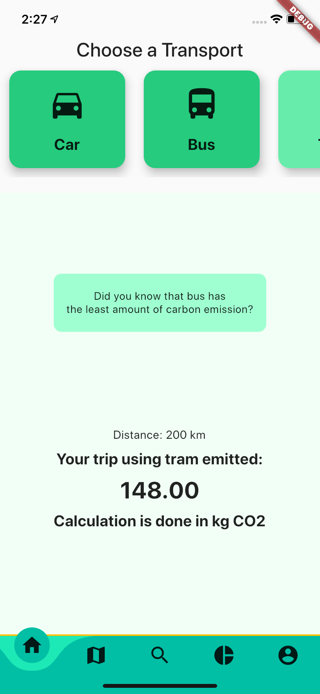
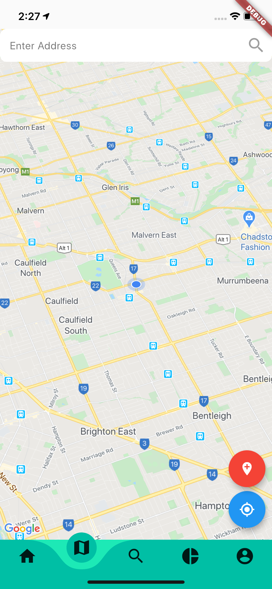
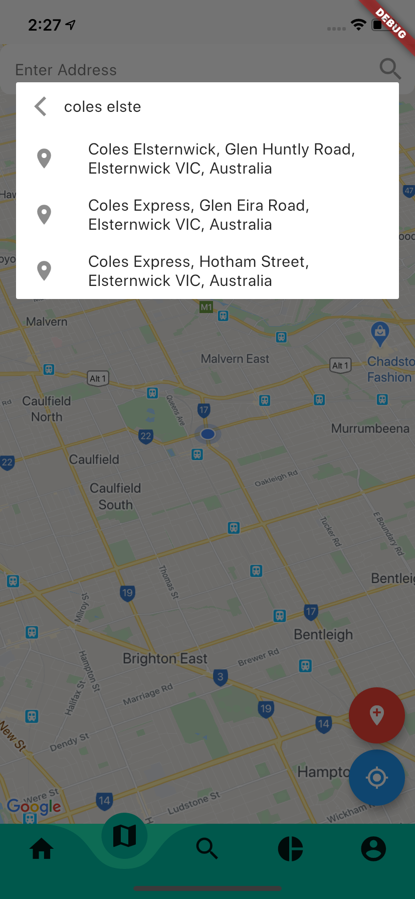
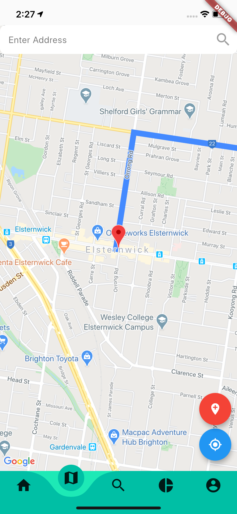

# Curbon 

An application created by Invictus Technology, Monash University. This app is aimed to help students to be aware of carbon emissions. We are aiming for a net-zero carbon emission. Curbon helps students to track, monitor, and learn from their previous trips, how much they are emitting. It will provide tips along the way for students to reduce their carbon emission

## Getting Started

This project is a starting point for a Flutter application.

A few resources to get you started if this is your first Flutter project:

- [Lab: Write your first Flutter app](https://flutter.dev/docs/get-started/codelab)
- [Cookbook: Useful Flutter samples](https://flutter.dev/docs/cookbook)

For help getting started with Flutter, view our
[online documentation](https://flutter.dev/docs), which offers tutorials,
samples, guidance on mobile development, and a full API reference.

This project folder contains carbon footprint calculator module and the map module.

Screen shots of our application:

## Carbon footprint calculator screen.
This page allows the user to select the mode of transport and calculate the total carbon emission that will be created for the particular trip

## Map screen
This page allows the user to search their destination and it also calculates distance between the source and destination of the trip and serves the calculation module for calculating carbon emission. 

It constitutes various components like it uses GoogleAPI for the map generation and for showing places recommendation in the search bar, it also provides polyline in order to show the appropriate route for the trip .

"# curbonapp" 
"# curbonapp" 
"# curbon" 
